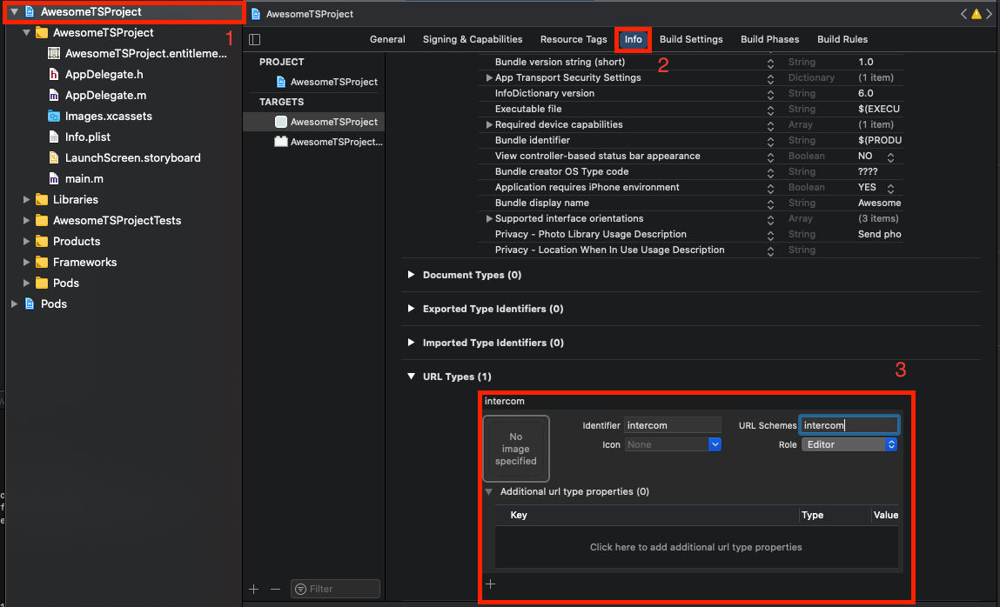

# Welcome to @intercom/intercom-react-native 👋

[](https://www.npmjs.com/package/@intercom/intercom-react-native)
[](https://github.com/intercom/intercom-react-native#readme)
[](https://github.com/intercom/intercom-react-native#readme)
[](https://github.com/intercom/intercom-react-native#readme)

> React Native wrapper to bridge our iOS and Android SDK

### 🏠 [Website](https://intercom.com/)

### 📚 [Developer Docs](https://developers.intercom.com/installing-intercom/docs/intercom-for-react-native)

---

### 📂 [Homepage](https://github.com/intercom/intercom-react-native#readme)

- [Installation](#installation)
  - [Android](#android)
    - [Automatic linking (React Native <=0.59)](#android-automatic-linking-with-react-native-v059-and-below)
    - [Manual linking (React Native <=0.59)](#android-manual-linking-with-react-native-v059-and-below)
    - [Setup](#android-setup)
    - [Permissions](#android-permissions)
    - [Push Notifications](#android-push-notifications)
    - [Push notification deep links support](#android-push-notification-deep-links-support)
  - [iOS](#ios)
    - [Manual linking (React Native <=0.59)](#ios-manual-linking-with-react-native-v059-and-below)
    - [Setup](#ios-setup)
    - [Permissions](#ios-permissions)
    - [Push Notifications](#ios-push-notifications)
    - [Push notification deep links support](#ios-push-notification-deep-links-support)
  - [Expo](#expo)
    - [Push Notifications](#expo-push-notifications)
    - [Push notification deep links support](#expo-push-notification-deep-links-support)
      - [Android](#android-deep-link)
      - [iOS](#ios-deep-link)
- [Versioning in dependencies](#versioning-in-dependencies)
- [Common methods](#methods)
  - [Types](#types)
- [Usage](#usage)
- [Troubleshooting](#troubleshooting)
- [Author](#author)
- [License](#license)

## Installation

```sh
npm install @intercom/intercom-react-native
```

or

```sh
yarn add @intercom/intercom-react-native
```

### Android

If you're using React Native v0.60 or above, the library will be linked automatically without any steps being taken.

#### Android: Automatic linking with React Native v0.59 and below

```
react-native link @intercom/intercom-react-native
```

#### Android: Manual linking with React Native v0.59 and below

- Add below code to `android/settings.gradle`

```Gradle
include ':intercom-react-native'
project(':intercom-react-native').projectDir = new File(rootProject.projectDir, '../node_modules/@intercom/intercom-react-native/android')
```

- Then edit `android/app/build.gradle`, inside `dependencies` at very bottom add

```Gradle
implementation project(':intercom-react-native')
```

#### Android: Setup

You have two options for initializing Intercom:

**Option 1: Native Initialization (Recommended)**
Initialize at app startup in your native code for the best user experience.

**Option 2: JavaScript Initialization**
Initialize manually from JavaScript for more control over timing. If you choose this option, skip the native initialization code below and see the [`initialize` method documentation](#intercomintializeapikey-appid) for implementation details.

**For Native Initialization:**

- Add below lines to `android/app/src/main/java/com/YOUR_APP/app/MainApplication.java` inside `onCreate` method, replacing `apiKey` and `appId` which can be found in your [workspace settings](https://app.intercom.com/a/apps/_/settings/android).

```java
import com.intercom.reactnative.IntercomModule; //  <-- Add this line

// ...

@Override
public void onCreate() {
  super.onCreate();
  SoLoader.init(this, /* native exopackage */ false);

  // ...

  IntercomModule.initialize(this, "apiKey", "appId"); // <-- Add this line

  // ...
}
```

- Open `android/build.gradle` and change `minSdkVersion` to **23**, `compileSdkVersion` and `targetSdkVersion` to **35**

```Gradle
buildscript {
    // ...
    ext {
        buildToolsVersion = "35.0.0"
        minSdkVersion = 23 // <-- Here
        compileSdkVersion = 35 // <-- Here
        targetSdkVersion = 35 // <-- Here
    }
    // ...
}
```

- In `android/build.gradle` make sure that `com.android.tools.build:gradle` version is greater than `4.0.0`

```Gradle
dependencies {
    classpath("com.android.tools.build:gradle:4.0.1")
    // ...
}
```

#### Android: Permissions

You will need to include the [READ_EXTERNAL_STORAGE](http://developer.android.com/reference/android/Manifest.permission.html#READ_EXTERNAL_STORAGE) permission in `android/app/src/main/AndroidManifest.xml` if you have enabled attachments:

```xml
<uses-permission android:name="android.permission.READ_EXTERNAL_STORAGE"/>
```

You can also include [VIBRATE](http://developer.android.com/reference/android/Manifest.permission.html#VIBRATE) to enable vibration in push notifications:

```xml
<uses-permission android:name="android.permission.VIBRATE"/>
```

#### Android: Push Notifications

For Push notification support add `GoogleServices` and `Firebase Cloud Messagng` to your app.

**More information about push notification setup [HERE](https://developers.intercom.com/installing-intercom/docs/android-fcm-push-notifications)**

- Inside `android/build.gradle` add

```Gradle
buildscript {
    // ...
    dependencies {
        // ...
        classpath 'com.google.gms:google-services:4.2.0' // <-- Add this
    }
}
```

- In `android/app/build.gradle` in dependencies add `Firebase Messaging` and at the very bottom apply `Google Services Plugin`:

```Gradle
// ...

dependencies{
    implementation "com.facebook.react:react-native:+"

    implementation 'com.google.firebase:firebase-messaging:20.2.+' // <-- Add this
    // ...
}
// ...

apply plugin: 'com.google.gms.google-services' // <-- Add this
apply from: file("../../node_modules/@react-native-community/cli-platform-android/native_modules.gradle"); applyNativeModulesAppBuildGradle(project)
```

- Place `google-services.json` in `android/app` directory.

- Create `MainNotificationService.java` inside your app directory(`com.example.app`) with below content:

  **_Remember to replace `package com.example.app;`, with your app package name_**

  - Default Notification Behavior (Goes back to the parent default launcher activity when the user taps the notification):

    ```java
    package com.example.app;

    import com.google.firebase.messaging.FirebaseMessagingService;
    import com.google.firebase.messaging.RemoteMessage;
    import com.intercom.reactnative.IntercomModule;

    public class MainNotificationService extends FirebaseMessagingService {

      @Override
      public void onNewToken(String refreshedToken) {
        IntercomModule.sendTokenToIntercom(getApplication(), refreshedToken);
        //DO LOGIC HERE
      }

      public void onMessageReceived(RemoteMessage remoteMessage) {
        if (IntercomModule.isIntercomPush(remoteMessage)) {
          IntercomModule.handleRemotePushMessage(getApplication(), remoteMessage);
        } else {
          // HANDLE NON-INTERCOM MESSAGE
        }
      }
    }
    ```

  - Custom Stack:

    ```java
    package com.example.app;

    import com.google.firebase.messaging.FirebaseMessagingService;
    import com.google.firebase.messaging.RemoteMessage;
    import com.intercom.reactnative.IntercomModule;

    public class MainNotificationService extends FirebaseMessagingService {

      @Override
      public void onNewToken(String refreshedToken) {
        IntercomModule.sendTokenToIntercom(getApplication(), refreshedToken);
        //DO LOGIC HERE
      }

      public void onMessageReceived(RemoteMessage remoteMessage) {
        if (IntercomModule.isIntercomPush(remoteMessage)) {
          TaskStackBuilder customStack = TaskStackBuilder.create(getApplication());
          customStack.addNextIntent(new Intent(getApplication(), MainActivity.class)); // Replace with your custom activity
          IntercomModule.handleRemotePushWithCustomStack(getApplication(), remoteMessage, customStack);
        } else {
          // HANDLE NON-INTERCOM MESSAGE
        }
      }
    }
    ```

- Edit `AndroidManifest.xml`. Add below content inside `<application>` below `<activity/>`

**Make sure that `xmlns:tools="http://schemas.android.com/tools"` is added to `manifest` tag**

```xml
<!-- Add xmlns:tools to manifest. See example below-->
<manifest
  xmlns:tools="http://schemas.android.com/tools"
>
  <application>
    <activity>
      ...
    </activity>
    ...

    <!-- START: Add this-->
    <service
      android:name=".MainNotificationService">
      <intent-filter>
        <action android:name="com.google.firebase.MESSAGING_EVENT"/>
      </intent-filter>
    </service>

    <!-- END: Add this-->

  </application>
</manifest>
```

- Add below code to your React Native app

```jsx
useEffect(() => {
  /**
   * Handle PushNotification
   */
  const appStateListener = AppState.addEventListener(
    'change',
    (nextAppState) => nextAppState === 'active' && Intercom.handlePushMessage()
  );
  return () => AppState.removeEventListener('change', () => true); // <- for RN < 0.65
  return () => appStateListener.remove(); // <- for RN >= 0.65
}, []);
```

#### Android: Push notification deep links support

- Add below code to `<activity>` inside `AndroidManifest.xml`

```xml

<activity
  android:name=".MainActivity"
  android:label="@string/app_name"
  android:configChanges="keyboard|keyboardHidden|orientation|screenSize|uiMode"
  android:launchMode="singleTask"
  android:windowSoftInputMode="adjustResize">
  <intent-filter>
    <action android:name="android.intent.action.MAIN"/>
    <category android:name="android.intent.category.LAUNCHER"/>
  </intent-filter>

  <!--  START: Add this  -->
  <intent-filter>
    <action android:name="android.intent.action.VIEW"/>
    <category android:name="android.intent.category.DEFAULT"/>
    <category android:name="android.intent.category.BROWSABLE"/>

    <data android:scheme="http" android:host="Your app url(www.app.com)"/> <!-- Edit this line -->
    <data android:scheme="Your app scheme(app)"/> <!-- Edit this line -->
  </intent-filter>
  <!--  END: Add this  -->

</activity>

```

Add the following in your `MainActivity`

```kotlin
  override fun onNewIntent(intent: Intent) {
    super.onNewIntent(intent)
    setIntent(intent)
  }
```

### IOS

Intercom for iOS requires a **minimum iOS version of 15.**

```sh
cd ios
pod install
cd ..
```

If you're using React Native v0.60 or above, the library will be linked automatically without any steps being taken.

#### iOS: Manual linking with React Native v0.59 and below

See [How to manually link IOS Intercom SDK](docs/IOS-MANUAL-LINKING.md)

#### iOS: Setup

You have two options for initializing Intercom:

**Option 1: Native Initialization (Recommended)**
Initialize at app startup in your native code for the best user experience.

**Option 2: JavaScript Initialization**
Initialize manually from JavaScript for more control over timing. If you choose this option, skip the native initialization code below and see the [`initialize` method documentation](#intercomintializeapikey-appid) for implementation details with platform-specific API key handling.

**For Native Initialization:**

- Open `ios/AppDelegate.m` then add below code:

- At the top of file add the following:

```Objective-C
#import "AppDelegate.h"
#import <React/RCTBridge.h>
#import <React/RCTBundleURLProvider.h>
#import <React/RCTRootView.h>
// ...
#import <IntercomModule.h> // <-- Add This
```

- Inside `didFinishLaunchingWithOptions` before `return YES` add, remember to replace `apiKey` and `appId` which can be found in your [workspace settings](https://app.intercom.com/a/apps/_/settings/ios):

```Objective-C
  // ...
  self.window.rootViewController = rootViewController;

  [IntercomModule initialize:@"apiKey" withAppId:@"appId"]; // <-- Add this

  return YES;
  }
```

**Swift Alternative:**

If you're using Swift, update your `AppDelegate.swift`:

- Add the import at the top:

```Swift
import intercom_react_native
```

- Inside `didFinishLaunchingWithOptions` before `return true`:

```Swift
func application(_ application: UIApplication, didFinishLaunchingWithOptions launchOptions: [UIApplication.LaunchOptionsKey: Any]?) -> Bool {
  ....
     Intercom.setApiKey("<Your iOS API Key>", forAppId: "<Your App ID>")
  ....
}

```

#### iOS: Permissions

Add these permissions to your `Info.plist`:

```xml
<!-- Optional: Camera access for taking photos in conversations -->
<key>NSCameraUsageDescription</key>
<string>Access your camera to take photos within a conversation</string>

<!-- Optional: Microphone access for voice message transcription (v9.3.0+) -->
<key>NSMicrophoneUsageDescription</key>
<string>Access your microphone to transcribe voice messages in conversations</string>
```

**Note:** These permissions are only requested when the user attempts to use the respective feature. You can customize the description strings to match your app's use case.

#### iOS: Push Notifications

> **Note**: You should request user permission to display push notifications.
> e.g. [react-native-permissions](https://github.com/zoontek/react-native-permissions)

Add **Push Notifications** and **Background Modes > Remote Notifications** [Details HERE](https://developer.apple.com/documentation/xcode/adding-capabilities-to-your-app)

**Option 1: In your JavaScript code**

An example using [react-native-notifications](https://wix.github.io/react-native-notifications):

```jsx
// Request notification permissions
Notifications.registerRemoteNotifications();

// When permission is granted, send the device token to Intercom using [Intercom.sendTokenToIntercom(token)](#intercomsendtokentointercomtoken)
Notifications.events().registerRemoteNotificationsRegistered(({ deviceToken }: Registered) => {
  Intercom.sendTokenToIntercom(deviceToken);
});
```

**Option 2: In your native code**

- In `AppDelegate.m` at the top add

```Objective-C
#import <UserNotifications/UserNotifications.h>
```

- Request notification permissions when app launches by adding the following to `didFinishLaunchingWithOptions` before `return YES;`:

```Objective-C
- (BOOL)application:(UIApplication *)application didFinishLaunchingWithOptions:(NSDictionary *)launchOptions
{
    // ...

    // START: Code to add
    UNUserNotificationCenter *center = [UNUserNotificationCenter currentNotificationCenter];
    [center requestAuthorizationWithOptions:(UNAuthorizationOptionAlert + UNAuthorizationOptionSound)
                          completionHandler:^(BOOL granted, NSError *_Nullable error) {
                          }];
    [[UIApplication sharedApplication] registerForRemoteNotifications];
    // END: Code to add

    return YES;
}
```

- In same file, above `@end` add the following to send the device token to Intercom when permission is granted:

```Objective-C
- (void)application:(UIApplication *)application didRegisterForRemoteNotificationsWithDeviceToken:(NSData *)deviceToken {
    [IntercomModule setDeviceToken:deviceToken];
}

@end
```

#### iOS: Push notification deep links support

Add URL types



Setup of React Native deep links can be found [Here](https://reactnative.dev/docs/linking#enabling-deep-links)

- Add import to `AppDelegate.m`

```Objective-C
#import "AppDelegate.h"

#import <React/RCTBridge.h>
#import <React/RCTBundleURLProvider.h>
#import <React/RCTRootView.h>

#import <React/RCTLinkingManager.h> <--Add this
```

- Add below code to `AppDelegate.m` above `@end`

```Objective-C
- (BOOL)application:(UIApplication *)application
   openURL:(NSURL *)url
   options:(NSDictionary<UIApplicationOpenURLOptionsKey,id> *)options
{
  return [RCTLinkingManager application:application openURL:url options:options];
}


- (BOOL)application:(UIApplication *)application openURL:(NSURL *)url
  sourceApplication:(NSString *)sourceApplication annotation:(id)annotation
{
  return [RCTLinkingManager application:application openURL:url
                      sourceApplication:sourceApplication annotation:annotation];
}

@end
```

See the [example app](https://github.com/intercom/intercom-react-native/blob/main/examples/example/src/App.tsx) for an example of how to handle deep linking in your app.

---

### Expo

If you are using Expo, you can use the built-in plugin.

After installing this npm package, add the [config plugin](https://docs.expo.io/guides/config-plugins/) to the [`plugins`](https://docs.expo.io/versions/latest/config/app/#plugins) array of your `app.json` or `app.config.js`:

```json
{
  "expo": {
    "plugins": ["@intercom/intercom-react-native"]
  }
}
```

The plugin provides props for extra customization. Every time you change the props or plugins, you'll need to rebuild (and `prebuild`) the native app. If no extra properties are added, defaults will be used.

- `appId` (_string_): App ID from Intercom.
- `androidApiKey` (_string_): Android API Key from Intercom.
- `iosApiKey` (_string_): iOS API Key from Intercom.
- `intercomRegion` (_string_): Region for Intercom `US`, `EU`, `AU`. Optional. Defaults to `US`.
- `useManualInit` (_boolean_): Set to `true` to manually initialize Intercom from JavaScript instead of at app startup. Optional. Defaults to `false`.

```json
{
  "expo": {
    "plugins": [
      [
        "@intercom/intercom-react-native",
        {
          "appId": "abc123",
          "androidApiKey": "android_sdk-abc123",
          "iosApiKey": "ios_sdk-abc123",
          "intercomRegion": "EU" // Europe
        }
      ]
    ]
  }
}
```

#### Manual Initialization with Expo

If you want to delay Intercom initialization and manually initialize it from JavaScript, you set the `useManualInit` option to `true`:

```json
{
  "expo": {
    "plugins": [
      [
        "@intercom/intercom-react-native",
        {
          "useManualInit": true
        }
      ]
    ]
  }
}
```

Then initialize Intercom manually in your JavaScript code with the platform-specific API keys:

```javascript
import Intercom from '@intercom/intercom-react-native';
import { Platform } from 'react-native';

// You can find your API keys in your Intercom workspace settings
// https://app.intercom.com/a/apps/<your-app-id>/settings/channels/messenger/install?tab=ios
const apiKey = Platform.select({
  ios: 'ios_sdk-abc123',
  android: 'android_sdk-abc123',
});

await Intercom.initialize(apiKey, 'abc123');
```

#### Expo: iOS Permissions

To enable camera and microphone features in your Expo app, add the following to your `app.json` or `app.config.js`:

```json
{
  "expo": {
    "ios": {
      "infoPlist": {
        "NSCameraUsageDescription": "Access your camera to take photos within a conversation",
        "NSMicrophoneUsageDescription": "Access your microphone to transcribe voice messages in conversations"
      }
    }
  }
}
```

**Note:** These permissions are required for iOS SDK 19.3.0+. The microphone permission enables voice message transcription. You can customize the description strings to match your app's use case.

After adding these permissions, run `npx expo prebuild` to regenerate the native iOS project with the updated Info.plist.

#### Expo: Push notifications

Add the following configurations into your `app.json` or `app.config.js`:

Place your `google-services.json` inside the project's root and link it

```json
{
  "expo": {
    ...
    "android": {
      "googleServicesFile": "./google-services.json",
      ...
    }
  }
```

Add the necessary permission descriptions to infoPlist key.

```json
{
  "expo": {
    ...
    "ios": {
      ...
      "infoPlist": {
        "NSCameraUsageDescription": "This is just a sample text to access the Camera",
      }
      ...
    }
  }
}
```

> **Note**: You should request user permission to display push notifications.
> e.g. [react-native-permissions](https://github.com/zoontek/react-native-permissions)

Next, rebuild your app as described in the ["Adding custom native code"](https://docs.expo.io/workflow/customizing/) guide.

#### Expo: Push notification deep links support

> **Note**: You can read more on Expo [documentation](https://docs.expo.dev/guides/deep-linking)

#### Android: Deep Link

```json
{
  "expo": {
    "android": {
      "intentFilters": [
        {
          "action": "VIEW",
          "data": [
            {
              "host": "Your app scheme(app)"
            }
          ],
          "category": ["BROWSABLE", "DEFAULT"]
        }
      ]
    }
  }
}
```

#### Android: App Links

```json
{
  "expo": {
    "android": {
      "intentFilters": [
        {
          "action": "VIEW",
          "autoVerify": true,
          "data": [
            {
              "scheme": "https",
              "host": "Your app url(www.app.com)",
              "pathPrefix": "Your url prefix e.g. /settings)"
            }
          ],
          "category": ["BROWSABLE", "DEFAULT"]
        }
      ]
    }
  }
}
```

#### iOS: Deep Link

```json
{
  "expo": {
    "ios": {
      "infoPlist": {
        "LSApplicationQueriesSchemes": ["Your app scheme(app)"]
      }
    }
  }
}
```

#### iOS: Universal Link

```json
{
  "expo": {
    "ios": {
      "infoPlist": {
        "IntercomUniversalLinkDomains": ["Your app url(www.app.com)"]
      }
    }
  }
}
```

---

### Versioning in dependencies

We define the iOS and Android versions used in React Native with optimistic operators
i.e. `~> for iOS` and `+ for Android`, ensuring compatibility while allowing for non-breaking updates:

iOS (~> in CocoaPods):
We use a version constraint e.g.`~> 18.6.1` which allows updates from `18.6.1 to 18.6.x` (up to but not including 18.7.0).

Android (+ in Gradle):
We use a version constraint e.g. `18.6.+` which allows updates to any patch version within 18.6.x

This means that by removing and reinstalling dependencies, you’ll automatically get the latest compatible patch version, which includes any fixes while avoiding breaking changes from a major version.

---

## Methods

## Import

### `import Intercom, { IntercomContent, Space } from '@intercom/intercom-react-native';`

---

### `Intercom.setUserHash(userHash) (Optional)`

Sets the user hash necessary for validation when Identity Verification is enabled.
**_This should be called before any registration calls._**

### Options

| Type     | Type   | Required |
| -------- | ------ | -------- |
| userHash | string | yes      |

### Returns

`Promise<boolean>`

---

### `Intercom.initialize(apiKey, appId)`

Initialize the Intercom SDK manually. This is useful when you want to delay initialization until after your app has started, or when using Expo with the `useManualInit` plugin option.

**Important:** This method configures the SDK but does NOT validate your credentials with Intercom's servers. Invalid API keys or App IDs will only be detected when you attempt to use Intercom features (e.g., login, show messenger). The method will return `true` if the SDK is successfully configured, regardless of credential validity.

### Options

| Name   | Type   | Required | Description                             |
| ------ | ------ | -------- | --------------------------------------- |
| apiKey | string | yes      | Your Platform-specific Intercom API key |
| appId  | string | yes      | Your Intercom App ID                    |

### Examples

```javascript
import { Platform } from 'react-native';

const apiKey = Platform.select({
  ios: 'ios_sdk-abc123',
  android: 'android_sdk-xyz789',
});

await Intercom.initialize(apiKey, 'your_app_id');
```

### Returns

`Promise<boolean>`

---

### `Intercom.loginUnidentifiedUser()`

Login a unidentified user.
This is a user that doesn't have any identifiable information such as a userId or email.

### Returns

`Promise<boolean>`

---

### `Intercom.loginUserWithUserAttributes({email,userId})`

Login a user with identifiable information.

### Options

One of below fields is required.

| Type   | Type   | Required |
| ------ | ------ | -------- |
| email  | string | no       |
| userId | string | no       |

### Returns

`Promise<boolean>`

---

### `Intercom.updateUser(userAttributes)`

Updates a user in Intercom.

###### You can send any data you like to Intercom. Typically our customers see a lot of value in sending data that

- ###### relates to customer development, such as price plan, value of purchases, etc. Once these have been sent to
- ###### Intercom you can then apply filters based on these attributes.

```javascript
Intercom.updateUser({
  email: 'name@intercom.com',
  userId: 'userId',
  name: 'Name',
  phone: '010-1234-5678',
  languageOverride: 'languageOverride',
  signedUpAt: 1621844451,
  unsubscribedFromEmails: true,
  companies: [
    {
      createdAt: 1621844451,
      id: 'companyId',
      monthlySpend: 100,
      name: 'CompanyName',
      plan: 'plan',
      customAttributes: {
        city: 'New York',
      },
    },
  ],
  customAttributes: {
    userCustomAttribute: 123,
    hasUserCustomAttribute: true,
  },
});
```

### Options

| Type                   | Type                                   | Required |
| ---------------------- | -------------------------------------- | -------- |
| userId                 | string                                 | no       |
| email                  | string                                 | no       |
| name                   | string                                 | no       |
| phone                  | string                                 | no       |
| languageOverride       | string                                 | no       |
| signedUpAt             | number (timestamp)                     | no       |
| unsubscribedFromEmails | boolean                                | no       |
| companies              | array                                  | no       |
| customAttributes       | object `{key: boolean,string, number}` | no       |

### Returns

`Promise<boolean>`

---

### `Intercom.logout()`

Logout is used to clear all local caches and user data the Intercom SDK has created. Use this at a time when you wish to
log a user out of your app or change a user. Once called, the SDK will no longer communicate with Intercom until a
further registration is made.

### Returns

`Promise<boolean>`

---

### `Intercom.logEvent(eventName, metaData)`

Logs an event with a given name and some metadata.

### Options

| Type      | Type                                  | Required |
| --------- | ------------------------------------- | -------- |
| eventName | string                                | yes      |
| metaData  | object `{key: boolean,string,number}` | no       |

### Returns

`Promise<boolean>`

---

### `Intercom.sendTokenToIntercom(token)`

This takes a push registration token to send to Intercom to enable this device to receive push.

### Options

| Type  | Type   | Required |
| ----- | ------ | -------- |
| token | string | yes      |

### Returns

`Promise<boolean>`

---

### `Intercom.getUnreadConversationCount()`

Gets the number of unread conversations for a user.

### Returns

`Promise<number>`

---

### `Intercom.handlePushMessage()`

Handles the opening of an Intercom push message. This will retrieve the URI from the last Intercom push message.

```javascript
useEffect(() => {
  /**
   * Handle PushNotification Open
   */
  const appStateListener = AppState.addEventListener(
    'change',
    (nextAppState) => nextAppState === 'active' && Intercom.handlePushMessage()
  );

  return () => AppState.removeEventListener('change', () => {}); // <- for RN < 0.65
  return () => appStateListener.remove(); // <- for RN >= 0.65
}, []);
```

### Returns

`Promise<boolean>`

---

### `Intercom.present()`

Opens the Intercom Messenger automatically to the best place for your users.

### Returns

`Promise<boolean>`

---

### `Intercom.presentMessageComposer(initialMessage)`

Open the conversation screen with the composer pre-populated text.

### Options

| Type           | Type   | Required |
| -------------- | ------ | -------- |
| initialMessage | string | no       |

### Returns

`Promise<boolean>`

---

### `Intercom.presentSpace(Space.helpCenter);`

Open up your apps help center

### Returns

`Promise<boolean>`

---

### `Intercom.presentContent(IntercomContent.helpCenterCollectionsWithIds(collections))`

Present the help center with specific collections only .

###### Note: If the requested collections cannot be found, the full help center will be shown instead.

### Options

| Type        | Type     | Required |
| ----------- | -------- | -------- |
| collections | string[] | no       |

### Returns

`Promise<boolean>`

---

### `Intercom.fetchHelpCenterCollections()`

Fetch a list of all Collections.

### Returns

`Promise<HelpCenterCollectionItem[]>`

---

### `Intercom.fetchHelpCenterCollection(collectionId)`

Get a list of subcollections/articles for a collection.

### Options

| Type         | Type   | Required |
| ------------ | ------ | -------- |
| collectionId | string | yes      |

### Returns

`Promise<HelpCenterCollectionContent>`

---

### `Intercom.searchHelpCenter(searchTerm)`

Get a list of articles in the Help Center, filtered by a search term

### Options

| Type       | Type   | Required |
| ---------- | ------ | -------- |
| searchTerm | string | yes      |

### Returns

`Promise<HelpCenterArticleSearchResult[]>`

---

### `Intercom.presentContent(IntercomContent.articleWithArticleId(articleId))`

Displays article with given id.

| Type      | Type   | Required |
| --------- | ------ | -------- |
| articleId | string | yes      |

### Returns

`Promise<boolean>`

---

### `Intercom.presentContent(IntercomContent.carouselWithCarouselId(carouselId))`

Displays carousel

### Options

| Type       | Type   | Required |
| ---------- | ------ | -------- |
| carouselId | string | yes      |

### Returns

`Promise<boolean>`

### Returns

`Promise<boolean>`

---

### `Intercom.setInAppMessageVisibility(visibility)`

Toggles visibility of in-app messages.

### Options

| Type       | Type                   | Required |
| ---------- | ---------------------- | -------- |
| visibility | string `GONE, VISIBLE` | yes      |

### Returns

`Promise<boolean>`

---

### `Intercom.setLauncherVisibility(visibility)`

Toggles visibility of the launcher view. Set as Intercom.Visibility.GONE to hide the launcher when you don't want it to
be visible.

### Options

| Type       | Type                   | Required |
| ---------- | ---------------------- | -------- |
| visibility | string `GONE, VISIBLE` | yes      |

### Returns

`Promise<boolean>`

---

### `Intercom.setBottomPadding(bottomPadding)`

Set the bottom padding of in app messages and the launcher.

Setting the bottom padding will increase how far from the bottom of the screen the default launcher and in app messages
will appear

### Options

| Type          | Type   | Required |
| ------------- | ------ | -------- |
| bottomPadding | number | yes      |

### Returns

`Promise<boolean>`

---

### `Intercom.setLogLevel(logLevel)`

Set the level of the native logger

### Options

| Type     | Type                                                          | Required |
| -------- | ------------------------------------------------------------- | -------- |
| logLevel | string(`ASSERT, DEBUG, DISABLED, ERROR, INFO, VERBOSE, WARN`) | yes      |

### Returns

`Promise<boolean>`

---

### `Intercom.bootstrapEventListeners()`

Bootstrap event listeners (Only for Android). This handles platform-specific setup and returns a cleanup function.
This must be called before setting up your own NativeEventEmitter.

### Returns

`() => void` - Cleanup function

### Usage

```javascript
import { NativeEventEmitter, NativeModules } from 'react-native';
import Intercom, { IntercomEvents } from '@intercom/intercom-react-native';

useEffect(() => {
  const cleanupIntercomEventListeners = Intercom.bootstrapEventListeners();

  const eventEmitter = new NativeEventEmitter(
    NativeModules.IntercomEventEmitter
  );

  // Listen to unread conversation count changes
  const unreadCountEventName = IntercomEvents.IntercomUnreadCountDidChange;
  const countListener = eventEmitter.addListener(
    unreadCountEventName,
    (response) => {
      console.log('Unread count:', response.count);
    }
  );

  return () => {
    countListener.remove();
    cleanupIntercomEventListeners();
  };
}, []);
```

### Available Events

| Event                                                | Platform     |
| ---------------------------------------------------- | ------------ |
| IntercomUnreadConversationCountDidChangeNotification | iOS, Android |
| IntercomHelpCenterDidShowNotification                | iOS          |
| IntercomHelpCenterDidHideNotification                | iOS          |
| IntercomWindowDidShowNotification                    | iOS          |
| IntercomWindowDidHideNotification                    | iOS          |

---

### Types

```typescript
type HelpCenterArticle = {
  it: string;
  title: string;
};

type HelpCenterCollectionItem = {
  id: string;
  title: string;
  summary: string;
};

type HelpCenterCollectionContent = {
  id: string;
  name: string;
  summary: string;
  articles: HelpCenterArticle[];
  collections: HelpCenterCollectionItem[];
};

type HelpCenterArticleSearchResult = {
  id: string;
  title: string;
  matchingSnippet: string;
  summary: string;
};
```

---

## Usage

### Example Apps

We provide two example applications to help you get started:

1. **[Standard Example](./examples/example/)** - A full-featured React Native app demonstrating all Intercom features (Runs Old React Native Architecture)
2. **[Expo Example](./examples/expo-example/)** - An Expo-based example (Runs New React Native Architecture)

[View the main example app code](./examples/example/src/App.tsx)

---

## Troubleshooting

- #### This project uses AndroidX dependencies, but the 'android.useAndroidX' property is not enabled.

  - To enable `jetifier`, add those two lines to your `gradle.properties` file:
    ```
    android.useAndroidX=true
    android.enableJetifier=true
    ```

- #### When Android app keeps stopping (E/AndroidRuntime: FATAL EXCEPTION: mqt_native_modules)

  - Add those lines to `dependencies` in `./android/app/build.gradle`:
    ```
    implementation 'androidx.appcompat:appcompat:1.1.0'
    implementation 'androidx.swiperefreshlayout:swiperefreshlayout:1.1.0-alpha03'
    ```

- #### When tests with Jest fail mentioning "Cannot read property 'UNREAD_CHANGE_NOTIFICATION' of undefined"
  - Make a `jest.mock` function with the library:
    ```
    // jest/setup.ts
    jest.mock('@intercom/intercom-react-native', () => jest.fn());
    ```

---

### `Intercom.setUserJwt(JWT)`

Sets a JWT token for the user, necessary for using the Messenger when Messenger Security is enforced. This is an
improvement to Identity Verification.

Secure your Messenger to make sure that bad actors can't impersonate your users, see their conversation history or make
unauthorized updates to data.

This should be called before any user login takes place.

### Options

| Type | Type   | Required |
| ---- | ------ | -------- |
| JWT  | string | yes      |

### Returns

`Promise<boolean>`

---

### `Intercom.setAuthTokens(authTokens)`

Provide Intercom with your auth tokens which can be used for functionality such as Custom Actions with Data Connectors. You can provide multiple
tokens at once. To create tokens:
1. Go to Settings > Integrations > Authentication in your Intercom workspace
2. Create a new token with "User" type
3. Configure the token prefix and header as needed

Learn more: https://www.intercom.com/help/en/articles/6615543-setting-up-data-connectors-authentication

This should be called after any user login takes place.

**Note:** This is separate from `setUserJwt()` which is for Messenger Security. `setAuthTokens()` passes JWT tokens to
Data Connectors (e.g., Fin Actions), which use these in `Authorization: Bearer <token>` headers for API requests.

### Options

| Name       | Type                        | Required | Description                                                  |
| ---------- | --------------------------- | -------- | ------------------------------------------------------------ |
| authTokens | `{ [key: string]: string }` | yes      | An object with token names as keys and JWT strings as values |

### Example

```typescript
Intercom.setAuthTokens({ security_token: "jwt_here" });
```

### Returns

`Promise<boolean>`

---

## Author

👤 **Intercom (https://www.intercom.com/)**

## Show your support

Give a ⭐️ if this project helped you!

## 📝 License

This project is [MIT](LICENSE) licensed.

---

Created with ❤️ by [Intercom](https://intercom.com/)
