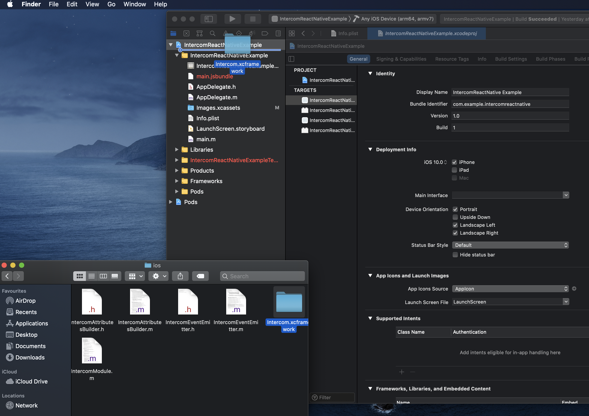
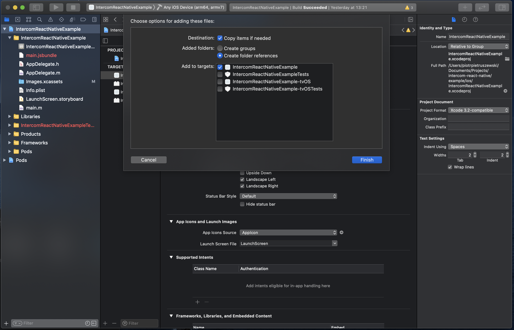

# Intercom IOS Manual linking

##More info about [Manual Linking](https://reactnative.dev/docs/linking-libraries-ios)

- ###In project root make `react-native link` command
- ###In Xcode open `YourApp.xcworkspace`, if there is no file with extension `xcworkspace` open `YourApp.xcodeproj`
- ###In file browser open `./node_modules/intercom-react-native/ios`
  - ###From file browser drag `Intercom.xcframework` and drop in Xcode window under YourProject name
    

___

- ###In popup mark `Copy items if needed`
  

___

- ###🎉 Done 🎉 Intercom SDK is linked
